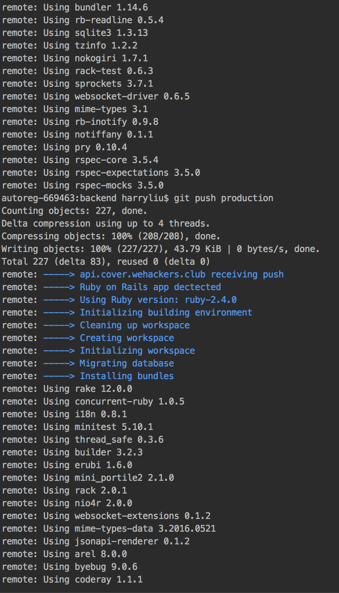
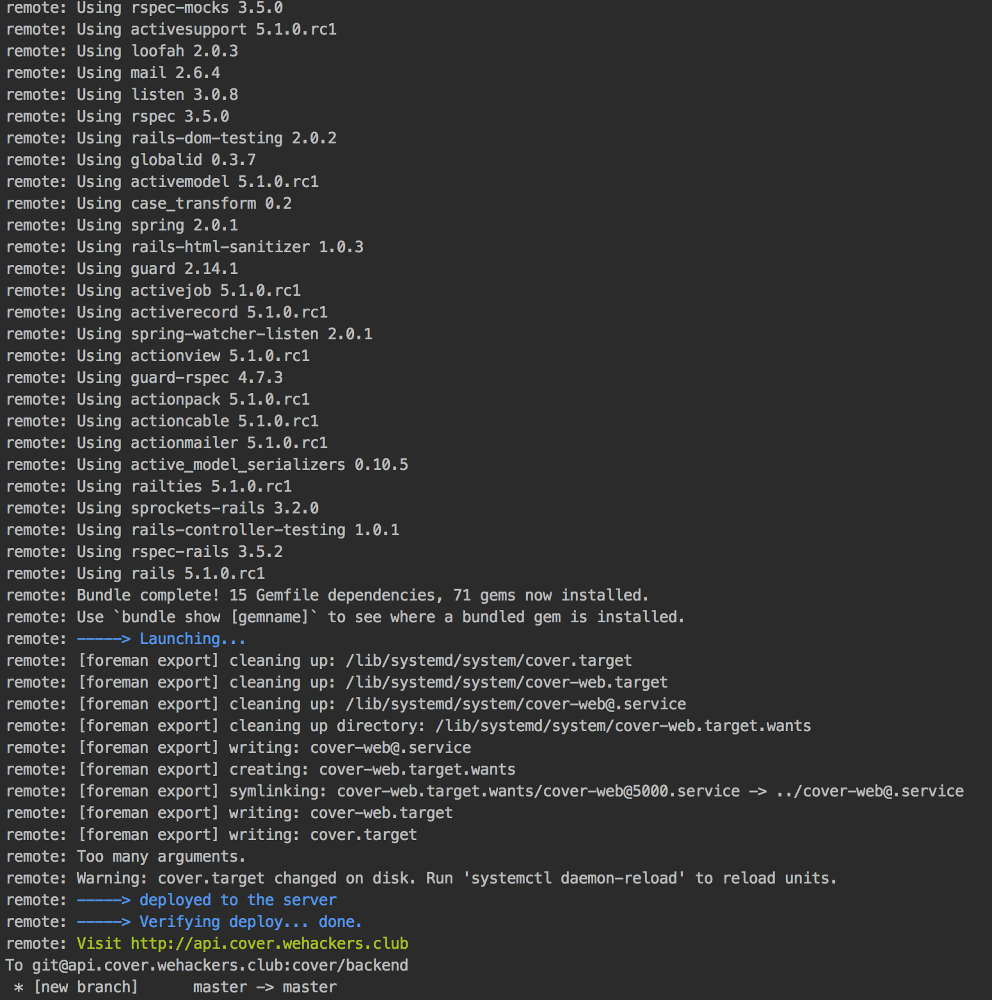
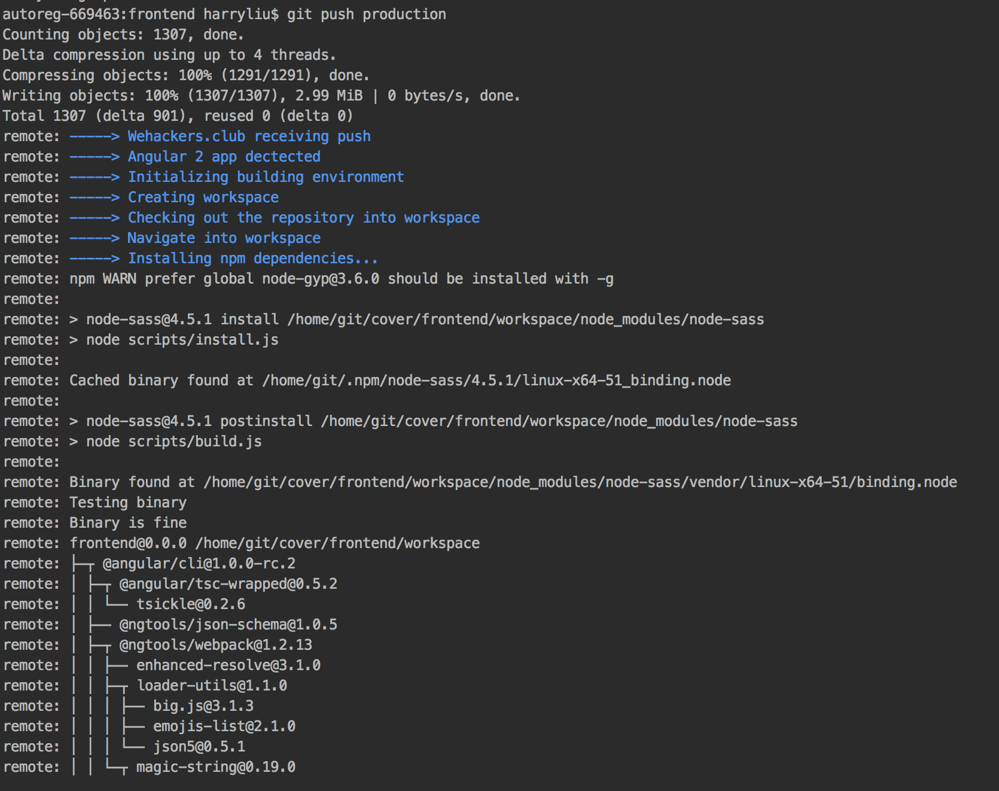

# HeroDeploy

Heroku like automatic deployment script for angular 2 and ruby on rails apps

## Preview
**Deploying ruby on rails project**





**Deploying Angular 2 project**




## Getting Started

These instructions will get you a copy of the project up and running on your local machine for development and testing purposes. See deployment for notes on how to deploy the project on a live system.

### Prerequisites

Please make sure the following programs are installed before running the script

* Machine running Ubuntu or macOs
* angular cli - Angular 2 command line tool
* Node.js - Universal javascript environment
* git - Version control
* ruby 2.4.0 - The latest ruby
* rbenv - Ruby version manager
* bundler - Rails package manager
* systemd - Process manager
* foreman - Procfile-based app manager

### Installing

A step by step series of examples that tell you have to get a development env running

**On the server**

Create user git

```
adduser git
```

Assign sudo privilages to user git

```
usermod -aG git
```

Switch to user git

```
su - git
```

Set SSH key for convience

```
touch ~/.ssh/authorized_keys && chmod 600 ~/.ssh/authorized_keys
```

Paste SSH public key to the authorized_key file for the git user

Initialize bare git repository on the server

```
mkdir ~/example-project
cd ~/example-project
git init
```

Navigate into .git folder

```
cd .git
```

Edit post-receive git-hook

```
nano hooks/post-receive
```

Paste the corresponding script into post-receive file

(**Remember to modify git work tree and git dir in the script**)

```
git --work-tree=/home/git/example-project/workspace --git-dir=/home/git/example-project checkout -f
```

Make git hooks executable

```
sudo chmod +x hooks/post-receive
```

Deployment begins after pushed repository from local machine to the server

**On local machine**

(**When configuring for backend project, copy the corresponding Procfile to the root of the repo**)

Add remote server to git

```
git add remote production git@example-project
```

Push the repository to the server

```
git push remote production master -u
```

You are done. Congratulations!

## Built With

* [angular cli ](https://cli.angular.io/) - Angular 2 command line tool
* [Node.js](https://nodejs.org/) - Universal javascript environment
* [git](https://git-scm.com/) - Version control
* [ruby](https://www.ruby-lang.org/) - Ruby interpreter
* [rbenv](http://rbenv.org/) - Ruby version manager
* [bundler](http://bundler.io/) - Rails package manager
* [systemd](https://www.freedesktop.org/wiki/Software/systemd/) - Process manager
* [foreman](https://github.com/ddollar/foreman/) - Procfile-based app manager

## Contributing

Please read [CONTRIBUTING.md](CONTRIBUTING.md) for details on our code of conduct, and the process for submitting pull requests to us.

## Versioning

We use [SemVer](http://semver.org/) for versioning. For the versions available, see the [tags on this repository](https://github.com/byliuyang/HeroDeploy/tags). 

## Authors

* **Harry** - *Initial work* - [byliuyang](https://github.com/byliuyang)

## License

This project is licensed under the MIT License - see the [LICENSE.md](LICENSE.md) file for details